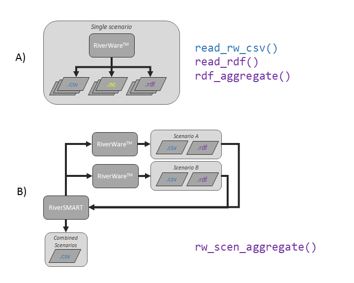

```{r setup, include = FALSE}
knitr::opts_chunk$set(
  collapse = TRUE,
  comment = "#>"
)
```

The RWDataPlyr package provides a tool to read and manipulate data generated from [RiverWare^TM^](http://riverware.org) simulations. The package provides an interface to read, aggregate, and summarize data from one or more RiverWare simulations. As RiverWare (and RiverSMART) produce data in multiple formats, and these data can be combined using RiverSMART in multiple ways, there are several different workflows that may make sense depending on the goals of the analysis. This vignette provides details on the different workflows that are covered by v0.6.0 of RWDataPlyr.

As of version 0.6.0, the package assumes the following:

* Data are monthly or annual.
* All data starts in January of one year and goes through December of another year, e.g., January 2014 through December 2060.

*Note that only the summary and aggregation functions include these implicit assumptions, i.e., reading rdfs should work regardless of timestep size, start timestep, and end timestep. However, only data conforming to these standards has been tested.*

## Background

[RiverWare^TM^](http://riverware.org) is a generalized river system modeling tool that represents physical processes and basin features, while allowing for complex resevoir operation policies to be expressed in rule-based logic. RiverWare is widely used accross the U.S. by the U.S. Army Corps, Bureau of Reclamation, and the Tennessee Valley Authority, to name a few agencies, to assist their water management missions, has applications worldwide, e.g., the Nile Basin, XXX, and XXX.  

One of the strengths of RiverWare is its "multiple run" mode, where many unique realizations, or traces, of hypothetical operations can be simulated with different input assumptions, e.g., hydrology. Multiple traces can be grouped together to form a single scenario, and it is often desireable to compare multiple scenarios together to understand how changes in assumptions affect model results. The RiverSMART tool is a wrapper to RiverWare (and other tools) that helps in the simulation and analysis of multiple scenarios. 

RiverWare stores important data in "slots" on "objects" in the RiverWare model file. Any subset of these data can be output and saved in ASCII text files, known as RiverWare data files, with a .rdf extension; csv files; and/or NetCDF files. When multiple scenarios are run using RiverSMART, these output files are saved in unique scenario folders. RiverSMART can also combine csv output from multiple scenarios into a single csv file to expedite the analysis. This setup is summarized in figure \@ref(fig:rwFlowChart). 

```{r, rwFlowChart, fig.cap="RiverWare and RiverSMART output flow chart.", echo=FALSE}

```

When using RiverSMART to simulate multiple scenarios, each with hundreds or thousands of traces of data, it is inreasingly easy to generate large amounts of data from RiverWare simulations. This package provides a tool to read these data into R, manipulate and summarize the data, and aggregate multiple scenarios' data together.

As there are multiple ways RiverWare and RiverSMART can generate the data, there are also different workflows that may expedite the analysis process. This vignette documents these different workflows.

